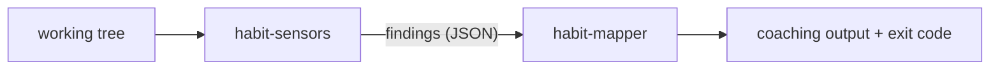

# Habit Hooks architecture

Habit Hooks is an automated code-quality coach for AI agents. It **finds smells, names them in a tool-independent vocabulary, and routes each to a fix** — usually a coaching prompt, occasionally a script that does the fix for you.

This document explains the concepts and overall architecture. Further details for each topic are linked at the end of the document.

## The pipeline

Habit Hooks can either be used with the single `habit-hooks` command, or by combining the two CLI tools it is composed of.

Running `habit-hooks <scope flags>` is equivalent to:
```
habit-sensors <scope flags> | habit-mapper
```



- **`habit-sensors`** runs the configured detectors over the files in scope and emits the findings array. See [habit-sensors.spec.md](habit-sensors.spec.md).
- **`habit-mapper`** groups the findings by smell, renders each smell's guide, and sets the exit code from each smell's severity. See [habit-mapper.spec.md](habit-mapper.spec.md).

The two stages pass only the findings array between them, so each runs — and can be replaced — on its own. See [habit-hooks.spec.md](habit-hooks.spec.md).

## How `habit-sensors` is built: sensors and transformers

`habit-sensors` detect code smells. They are - in most cases - deterministic scripts that rely on string operations and syntax tree analysis to identify potential issues.

A common pattern for implementing a `habit-sensor` is wrapping an existing tool (like a linter or duplication detector), and transforming its output to match the habit-mapper's interface.

When wrapping existing tools we either use the projects existing setup, or in the absence of that we provide our own as a transitive dependency. Since a project might be using rule sets not handled by Habit Hooks the wrapper must pass through every finding it does not handle.

## The finding

Habit sensors output **findings**. A finding names one smell and lists where it occurs:

```jsonc
{
  "smell": "too-many-parameters",   // the routing key — which fix this needs
  "language": "python",             // optional second key — prefers a language's fix
  "details": { "maxAllowed": 3 },   // facts about the smell itself
  "issues": [                       // one entry per occurrence
    { "key": "src/billing.py",
      "details": { "file": "src/billing.py", "line": 2, "signature": "bill(...)" } }
  ]
}
```

The field-by-field contract — the output every sensor must produce and every transformer must preserve — is specified in more detail in [sensor-interface.spec.md](sensor-interface.spec.md).

## The smell key

Each sensor translates a tool's raw rule IDs into a canonical **smell key**, and everything downstream routes on that key alone:

```
ESLint  max-params  ─┐
Ruff    PLR0913     ─┼──►  too-many-parameters  ──►  too-many-parameters.md
Biome   noTooMany.. ─┘
```

The canonical catalogue of smells is in [smell-vocabulary.md](smell-vocabulary.md).

## Plugins

Plugins collect the different sensors and guides that are useful in the context of working with a specific language. Habit Hooks without any plugins installed is only the plumbing, hence it is recommended that users install the `generic` plugin - which provides sensors and guides that work for most languages as a basis - and the plugin(s) (`habit-hooks-<language_name>`) specific to the languages used in their project.

To load specific plugins add the list of them in the projects `.habit-hooks/config.toml` file. 

```toml
plugins = ["python", "generic"]
```

For more information on how to configure Habit Hooks see: [config.md](config.md).

For guidance on building plugins see the [authoring-plugins.spec.md](authoring-plugins.spec.md) guide.

## The documents

| Document | What it covers |
|----------|----------------|
| [sensor-interface.spec.md](sensor-interface.spec.md) | the finding — the data every stage passes |
| [habit-sensors.spec.md](habit-sensors.spec.md) | the runner: assembling and running the ETL |
| [habit-mapper.spec.md](habit-mapper.spec.md) | routing findings to guides and the exit code |
| [habit-snooze.spec.md](habit-snooze.spec.md) | the snooze transformer and its index commands |
| [habit-hooks.spec.md](habit-hooks.spec.md) | the two stages composed |
| [habit-hooks-init.spec.md](habit-hooks-init.spec.md) | setting a project up: the config it writes and what it reports |
| [authoring-plugins.spec.md](authoring-plugins.spec.md) | building a plugin: sensor, transformer, guide |
| [config.md](config.md) | the TOML config format |
| [smell-vocabulary.md](smell-vocabulary.md) | the canonical smell catalogue |
| [executable_spec.md](executable_spec.md) | how the `*.spec.md` files run as tests |
